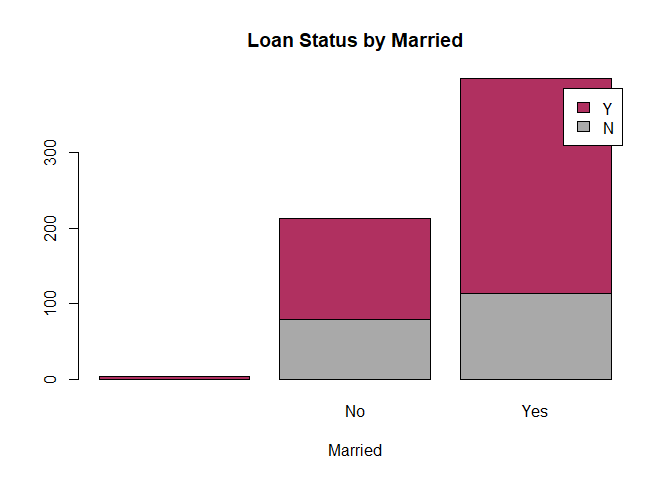

# 1. Defining the question

## a) Specifiying the data analytic question

Given several variables such as Credit History and Income, is an
individual eligible to a loan? i.e should their loan status be ‘Y’(for
Yes) or ‘N’(for No)?

## b) Defining the metric for success

Build a prediction/classification model with 80% accuracy

## c) Understanding the context

The desire to re-imagine credit default prediction by applying Machine
Learning techniques such as Logistic regression,Naive Bayes and Decision
Trees on available data. At the moment most loans are given based on
credit history. This project will serve as a starting point in learning
more about credit eligibility and the factors influencing it.

## d) Recording the experimental design

1)  Read the data
2)  Checking the data
3)  Tidying the dataset
4)  EDA
5)  Deploying our model
6)  Discussion about the model

## e) Data Relevance

This is a common dataset from Dream Housing Finance company that deals
in all home loans. It has been used in several loan eligibilty
classification and prediction challenges on kaggle. For instance,
<https://www.kaggle.com/code/vikasukani/loan-eligibility-prediction-machine-learning/notebook>

# 2. Reading the data

``` r
#importing libraries
install.packages('janitor')
```

    ## Installing package into 'C:/Users/User/AppData/Local/R/win-library/4.2'
    ## (as 'lib' is unspecified)

    ## Error in contrib.url(repos, "source"): trying to use CRAN without setting a mirror

``` r
install.packages("Hmisc")
```

    ## Installing package into 'C:/Users/User/AppData/Local/R/win-library/4.2'
    ## (as 'lib' is unspecified)

    ## Error in contrib.url(repos, "source"): trying to use CRAN without setting a mirror

``` r
install.packages("glmnet", repos = "https://cran.us.r-project.org")
```

    ## Installing package into 'C:/Users/User/AppData/Local/R/win-library/4.2'
    ## (as 'lib' is unspecified)

    ## package 'glmnet' successfully unpacked and MD5 sums checked
    ## 
    ## The downloaded binary packages are in
    ##  C:\Users\User\AppData\Local\Temp\RtmpYDrKq8\downloaded_packages

``` r
#loading the libraries
library(janitor)
```

    ## 
    ## Attaching package: 'janitor'

    ## The following objects are masked from 'package:stats':
    ## 
    ##     chisq.test, fisher.test

``` r
library(Hmisc)
```

    ## Loading required package: lattice

    ## Loading required package: survival

    ## Loading required package: Formula

    ## Loading required package: ggplot2

    ## 
    ## Attaching package: 'Hmisc'

    ## The following objects are masked from 'package:base':
    ## 
    ##     format.pval, units

``` r
library(ggplot2)
library(dplyr)
```

    ## 
    ## Attaching package: 'dplyr'

    ## The following objects are masked from 'package:Hmisc':
    ## 
    ##     src, summarize

    ## The following objects are masked from 'package:stats':
    ## 
    ##     filter, lag

    ## The following objects are masked from 'package:base':
    ## 
    ##     intersect, setdiff, setequal, union

``` r
library(outliers)
library(caret)
```

    ## 
    ## Attaching package: 'caret'

    ## The following object is masked from 'package:survival':
    ## 
    ##     cluster

``` r
#reading our data
train <- read.csv(url("https://raw.githubusercontent.com/mridulrb/Predict-loan-eligibility-using-IBM-Watson-Studio/master/Dataset/Dataset.csv"))
head(train)
```

    ##    Loan_ID Gender Married Dependents    Education Self_Employed ApplicantIncome
    ## 1 LP001002   Male      No          0     Graduate            No            5849
    ## 2 LP001003   Male     Yes          1     Graduate            No            4583
    ## 3 LP001005   Male     Yes          0     Graduate           Yes            3000
    ## 4 LP001006   Male     Yes          0 Not Graduate            No            2583
    ## 5 LP001008   Male      No          0     Graduate            No            6000
    ## 6 LP001011   Male     Yes          2     Graduate           Yes            5417
    ##   CoapplicantIncome LoanAmount Loan_Amount_Term Credit_History Property_Area
    ## 1                 0         NA              360              1         Urban
    ## 2              1508        128              360              1         Rural
    ## 3                 0         66              360              1         Urban
    ## 4              2358        120              360              1         Urban
    ## 5                 0        141              360              1         Urban
    ## 6              4196        267              360              1         Urban
    ##   Loan_Status
    ## 1           Y
    ## 2           N
    ## 3           Y
    ## 4           Y
    ## 5           Y
    ## 6           Y

# 3. Checking the data

``` r
#reviewing the structure of our data to further help with data understanding
str(train)
```

    ## 'data.frame':    614 obs. of  13 variables:
    ##  $ Loan_ID          : chr  "LP001002" "LP001003" "LP001005" "LP001006" ...
    ##  $ Gender           : chr  "Male" "Male" "Male" "Male" ...
    ##  $ Married          : chr  "No" "Yes" "Yes" "Yes" ...
    ##  $ Dependents       : chr  "0" "1" "0" "0" ...
    ##  $ Education        : chr  "Graduate" "Graduate" "Graduate" "Not Graduate" ...
    ##  $ Self_Employed    : chr  "No" "No" "Yes" "No" ...
    ##  $ ApplicantIncome  : int  5849 4583 3000 2583 6000 5417 2333 3036 4006 12841 ...
    ##  $ CoapplicantIncome: num  0 1508 0 2358 0 ...
    ##  $ LoanAmount       : int  NA 128 66 120 141 267 95 158 168 349 ...
    ##  $ Loan_Amount_Term : int  360 360 360 360 360 360 360 360 360 360 ...
    ##  $ Credit_History   : int  1 1 1 1 1 1 1 0 1 1 ...
    ##  $ Property_Area    : chr  "Urban" "Rural" "Urban" "Urban" ...
    ##  $ Loan_Status      : chr  "Y" "N" "Y" "Y" ...

The Loan_ID, Gender, Married, Dependents, Education, Propoerty Area and
Loan_Status are of character datatype ApplicantIncome,LoanAmount,
Loan_Amount_Term and CreditHistory are all integer datatype
Co-applicantIncome is of numeric datatype

``` r
#changing the character type features into factors because most of them are in fact categorical

train <- train %>% mutate_if(is.character, as.factor)
str(train)
```

    ## 'data.frame':    614 obs. of  13 variables:
    ##  $ Loan_ID          : Factor w/ 614 levels "LP001002","LP001003",..: 1 2 3 4 5 6 7 8 9 10 ...
    ##  $ Gender           : Factor w/ 3 levels "","Female","Male": 3 3 3 3 3 3 3 3 3 3 ...
    ##  $ Married          : Factor w/ 3 levels "","No","Yes": 2 3 3 3 2 3 3 3 3 3 ...
    ##  $ Dependents       : Factor w/ 5 levels "","0","1","2",..: 2 3 2 2 2 4 2 5 4 3 ...
    ##  $ Education        : Factor w/ 2 levels "Graduate","Not Graduate": 1 1 1 2 1 1 2 1 1 1 ...
    ##  $ Self_Employed    : Factor w/ 3 levels "","No","Yes": 2 2 3 2 2 3 2 2 2 2 ...
    ##  $ ApplicantIncome  : int  5849 4583 3000 2583 6000 5417 2333 3036 4006 12841 ...
    ##  $ CoapplicantIncome: num  0 1508 0 2358 0 ...
    ##  $ LoanAmount       : int  NA 128 66 120 141 267 95 158 168 349 ...
    ##  $ Loan_Amount_Term : int  360 360 360 360 360 360 360 360 360 360 ...
    ##  $ Credit_History   : int  1 1 1 1 1 1 1 0 1 1 ...
    ##  $ Property_Area    : Factor w/ 3 levels "Rural","Semiurban",..: 3 1 3 3 3 3 3 2 3 2 ...
    ##  $ Loan_Status      : Factor w/ 2 levels "N","Y": 2 1 2 2 2 2 2 1 2 1 ...

``` r
cat('The dimensions for the train data:',dim(train),'\n')
```

    ## The dimensions for the train data: 614 13

``` r
#Previewing the target variable column
tabyl(train$Loan_Status)
```

    ##  train$Loan_Status   n   percent
    ##                  N 192 0.3127036
    ##                  Y 422 0.6872964

``` r
#About 69% of people have been approved for loans and 31% have been rejected
```

\#4. Tidying the Dataset

``` r
# Checking for missing values
anyNA(train)
```

    ## [1] TRUE

``` r
colSums(is.na(train))
```

    ##           Loan_ID            Gender           Married        Dependents 
    ##                 0                 0                 0                 0 
    ##         Education     Self_Employed   ApplicantIncome CoapplicantIncome 
    ##                 0                 0                 0                 0 
    ##        LoanAmount  Loan_Amount_Term    Credit_History     Property_Area 
    ##                22                14                50                 0 
    ##       Loan_Status 
    ##                 0

``` r
#There are missing values in the LoanAmount, Loan_Amount_Term and Credit_History columns
#will decide what to do with this after EDA
```

``` r
#missing values
#imputing the nas for loan amount term with the mode since it is a very disctinct feature in the histograms

#getting the mode for Loan Amount Term
find_mode <- function(x) {
  u <- unique(x)
  tab <- tabulate(match(x, u))
  u[tab == max(tab)]
}

find_mode(train$Loan_Amount_Term)
```

    ## [1] 360

``` r
#imputing the mode
train$Loan_Amount_Term[is.na(train$Loan_Amount_Term)] <- 360
```

``` r
#opting to fill the NAs in loanAmount with the mean since the values are numerical

train$LoanAmount[is.na(train$LoanAmount)] <- mean(train$LoanAmount, na.rm = TRUE)
```

``` r
#Opting to fill the NAs in credit history with the mode which is 1, from the 'failed' histogram
#might have deleted but was explored in initial rmd file

train$Credit_History[is.na(train$Credit_History)] <- 1
```

``` r
#checking for missing values after understanding and tidying the dataset
anyNA(train)
```

    ## [1] FALSE

``` r
#successfully tidied up the dataset
```

``` r
#looking at our train data summary
summary(train)
```

    ##      Loan_ID       Gender    Married   Dependents        Education  
    ##  LP001002:  1         : 13      :  3     : 15     Graduate    :480  
    ##  LP001003:  1   Female:112   No :213   0 :345     Not Graduate:134  
    ##  LP001005:  1   Male  :489   Yes:398   1 :102                       
    ##  LP001006:  1                          2 :101                       
    ##  LP001008:  1                          3+: 51                       
    ##  LP001011:  1                                                       
    ##  (Other) :608                                                       
    ##  Self_Employed ApplicantIncome CoapplicantIncome   LoanAmount   
    ##     : 32       Min.   :  150   Min.   :    0     Min.   :  9.0  
    ##  No :500       1st Qu.: 2878   1st Qu.:    0     1st Qu.:100.2  
    ##  Yes: 82       Median : 3812   Median : 1188     Median :129.0  
    ##                Mean   : 5403   Mean   : 1621     Mean   :146.4  
    ##                3rd Qu.: 5795   3rd Qu.: 2297     3rd Qu.:164.8  
    ##                Max.   :81000   Max.   :41667     Max.   :700.0  
    ##                                                                 
    ##  Loan_Amount_Term Credit_History    Property_Area Loan_Status
    ##  Min.   : 12.0    Min.   :0.000   Rural    :179   N:192      
    ##  1st Qu.:360.0    1st Qu.:1.000   Semiurban:233   Y:422      
    ##  Median :360.0    Median :1.000   Urban    :202              
    ##  Mean   :342.4    Mean   :0.855                              
    ##  3rd Qu.:360.0    3rd Qu.:1.000                              
    ##  Max.   :480.0    Max.   :1.000                              
    ## 

``` r
# the loan amount, applicant income and coapplicant income column seems to have extreme outliers
```

``` r
#checking for outliers in numeric and integer features
outlier(train$ApplicantIncome)
```

    ## [1] 81000

``` r
outlier(train$CoapplicantIncome)
```

    ## [1] 41667

``` r
outlier(train$LoanAmount)
```

    ## [1] 700

``` r
outlier(train$Loan_Amount_Term)
```

    ## [1] 12

``` r
# there are outliers in some of the numeric and integer features in the dataset
# visualizing the outliers in all int columns

par(mfrow = c(2,2))
boxplot(train$ApplicantIncome, main = "Applicant Income")
boxplot(train$CoapplicantIncome, main = "Coapplicant Income")
boxplot(train$LoanAmount, main = "Loan Amount")
boxplot(train$Loan_Amount_Term, main = "Loan Amount Term")
```

<!-- -->

``` r
boxplot(train$Credit_History, main = "Credit History")
#all of the integer columns have outliers except for Credit_History
#The visualizations for outlier detection also serve as univariate analysis for integer variables
```

<!-- -->

``` r
#viewing histograms of the outliers
par(mfrow = c(2,2))
hist(train$LoanAmount, breaks = 50, main = "Loan Amount")
hist(train$ApplicantIncome, breaks = 50, main = "Applicant Income")
hist(train$CoapplicantIncome, breaks = 50, main = "Coapplicant Income")
hist(train$Loan_Amount_Term, breaks = 50, main = "Loan Amount Term")
```

<!-- -->

``` r
#hist(train$Credit_History, breaks = 50, main = "Credit History")
#this was where I noticed that the credit_History is probably a factor so after re-arranging code this doesn't work anymore
```

## Handling outliers and missing values

I chose not to drop outliers because it is normal for some people to
apply for very big loans as well as have few but extremely high incomes
in a population

From the histograms, the CreditHistory plot looks odd. This is because
CreditHistory is not numeric but rather a category showing whether or
not one has credit history.

``` r
#changing creditHistory to a factor

train$Credit_History = as.factor(train$Credit_History)
```

# 5. Exploratory Data Analysis

## a) Univariate Analysis of Categorical Variables

``` r
#barplots of categorical variables

barplot(table(train$Gender), main="Barplot of Gender",xlab="Gender", col= rainbow(3))
```

<!-- -->

``` r
barplot(table(train$Married), main="Barplot of Married",xlab="Married", col= rainbow(3))
```

<!-- -->

``` r
barplot(table(train$Dependents), main="Barplot of Dependents",xlab="Dependents", col= rainbow(5))
```

<!-- -->

``` r
barplot(table(train$Education), main="Barplot of Education",xlab="Education", col= rainbow(2))
```

<!-- -->

``` r
barplot(table(train$Self_Employed), main="Barplot of Self Employed",xlab="Self Employed", col= rainbow(3))
```

<!-- -->

``` r
barplot(table(train$Gender), main="Barplot of Property Area",xlab="Property Area", col= rainbow(3))
```

<!-- -->

``` r
barplot(table(train$Loan_Status), main="Barplot of Loan Status",xlab="Loan Status", col= rainbow(2))
```

<!-- -->
Majority of the individuals represented in the dataset: a) Male gender
b) Married c) Have 0 dependents d) Are graduates e) are not
self-employed f) have a loan status of ‘Y’

``` r
#correctly visualizing CreditHistory
barplot(table(train$Credit_History), main="Barplot of Credit History",xlab="Credit History", col= rainbow(2))
```

<!-- -->
Most of the people in the dataset have a credit history

## b) Bivariate Analysis

To simplify this step variables will be plotted against our target
variable, LoanStatus

``` r
counts <- table(train$Loan_Status, train$Gender)
barplot(counts, main="Loan Status by Gender",
        xlab="Gender", col=c("darkgrey","maroon"),
        legend = rownames(counts))
```

<!-- -->
Majority of borrowers are male

``` r
counts2 <- table(train$Loan_Status, train$Education)
barplot(counts2, main="Loan Status by Education",
        xlab="Education", col=c("darkgrey","maroon"),
        legend = rownames(counts2))
```

<!-- -->
Majority of borrowers are graduates

``` r
counts3 <- table(train$Loan_Status, train$Married)
barplot(counts3, main="Loan Status by Married",
        xlab="Married", col=c("darkgrey","maroon"),
        legend = rownames(counts3))
```

<!-- -->
Most borrowers are married

``` r
counts4 <- table(train$Loan_Status, train$Self_Employed)
barplot(counts4, main="Loan Status by Self Employed",
        xlab="Self_Employed", col=c("darkgrey","maroon"),
        legend = rownames(counts4))
```

<!-- -->
Most of the borrowers are not self-employed

``` r
counts5 <- table(train$Loan_Status, train$Property_Area)
barplot(counts5, main="Loan Status by Property_Area",
        xlab="Property_Area", col=c("darkgrey","maroon"),
        legend = rownames(counts5))
```

<!-- -->
\$the property locations are almost equally distributed among rural,
urban and semi-urban areas. However, the majority of the homes are in
Semiurban areas

``` r
counts6 <- table(train$Loan_Status, train$Credit_History)
barplot(counts6, main="Loan Status by Credit_History",
        xlab="Credit_History", col=c("darkgrey","maroon"),
        legend = rownames(counts5))
```

<!-- -->
From the proportions, having a credit history makes it far more likely
for you to have a loan Status of ‘Y’.

# 6.Data Pre-processing

``` r
#checking the proportion of the target variable
prop.table(table(train$Loan_Status))%>% round(2)
```

    ## 
    ##    N    Y 
    ## 0.31 0.69

``` r
#The data has a ratio of close to 1:2
```

## Feature Engineering and Log transformation

``` r
#from the histograms in the outlier/univariate analysis section, the data has extreme outliers which I chose to keep. The data is also skewed. 
#We are going to carry out a log transform to normalize the data, thus reducing bias

train$LogLoanAmount <- log(train$LoanAmount)
par(mfrow=c(1,2))
hist(train$LogLoanAmount, 
     main="Histogram for Loan Amount", 
     xlab="Loan Amount", 
     border="blue", 
     col="maroon",
     las=1, 
     breaks=20, prob = TRUE)
lines(density(train$LogLoanAmount), col='black', lwd=3)
boxplot(train$LogLoanAmount, col='maroon',xlab = 'Income', main = 'Box Plot for Loan Amount')
```

<!-- -->

``` r
#combining the applicant income and coapplicant income, this seems to be the most conventional way of working with this dataset
#Note: The applicantincome and coapplicantIncome both have extreme outliers so they are subject to log transformation
train$Income <- train$ApplicantIncome + train$CoapplicantIncome
train$ApplicantIncome <- NULL
train$CoapplicantIncome <- NULL
train$LogIncome <- log(train$Income)
par(mfrow=c(1,2))
hist(train$LogIncome, 
     main="Histogram for Combined Income", 
     xlab="Income", 
     border="blue", 
     col="maroon",
     las=1, 
     breaks=50, prob = TRUE)
lines(density(train$LogIncome), col='black', lwd=3)
boxplot(train$LogIncome, col='maroon',xlab = 'Income', main = 'Box Plot for Combined Income')
```

<!-- -->

``` r
#the data is somewhat normal, hence will give better results than it would in its initial form
```

``` r
#reviewing data to see changes
head(train)
```

    ##    Loan_ID Gender Married Dependents    Education Self_Employed LoanAmount
    ## 1 LP001002   Male      No          0     Graduate            No   146.4122
    ## 2 LP001003   Male     Yes          1     Graduate            No   128.0000
    ## 3 LP001005   Male     Yes          0     Graduate           Yes    66.0000
    ## 4 LP001006   Male     Yes          0 Not Graduate            No   120.0000
    ## 5 LP001008   Male      No          0     Graduate            No   141.0000
    ## 6 LP001011   Male     Yes          2     Graduate           Yes   267.0000
    ##   Loan_Amount_Term Credit_History Property_Area Loan_Status LogLoanAmount
    ## 1              360              1         Urban           Y      4.986426
    ## 2              360              1         Rural           N      4.852030
    ## 3              360              1         Urban           Y      4.189655
    ## 4              360              1         Urban           Y      4.787492
    ## 5              360              1         Urban           Y      4.948760
    ## 6              360              1         Urban           Y      5.587249
    ##   Income LogIncome
    ## 1   5849  8.674026
    ## 2   6091  8.714568
    ## 3   3000  8.006368
    ## 4   4941  8.505323
    ## 5   6000  8.699515
    ## 6   9613  9.170872

``` r
#removing loanAmount and The combined Applicants' income i.e. Income variable

train$Income <- NULL
train$LoanAmount <- NULL
```

``` r
#splitting into train and test set at 70%:30%
#due to the size of the data having a slightly smaller train set than usual, the 70:30 split is good to help avoid over-fitting

#set.seed(123)
#sample <- sample.int(n = nrow(train), size = floor(.70*nrow(train)), replace = FALSE)
#trainn <- train[sample, ]
#testn  <- train[-sample, ]
```

\#7. Data Modelling \## Logistic Regression

For this prediction I intended to use logistic regression using the
step-wise feature selection approach, however the model not converging.
Among the suggested solutions is the use of lasso regression, which is
what I found easiest to implement.

``` r
#splitting the data
set.seed(123)
#dropping the LoanID column as it causes dimensionality problems
train <- train[-1]
training.samples <- train$Loan_Status %>% 
  createDataPartition(p = 0.7, list = FALSE)
train.data  <- train[training.samples, ]
test.data <- train[-training.samples, ]
```

``` r
# Creating Dummy variables for categorical predictor variables
x <- model.matrix(Loan_Status~., train.data)[,-1]
# Convert the outcome (class) to a numerical variable
y <- ifelse(train.data$Loan_Status == "Y", 1, 0)
```

``` r
#fitting the penalized lasso regression model
#loading library
library(glmnet)
```

    ## Loading required package: Matrix

    ## Loaded glmnet 4.1-4

``` r
# Find the best lambda using cross-validation
set.seed(123) 
cv.lasso <- cv.glmnet(x, y, alpha = 1, family = "binomial")
# Fit the final model on the training data
model <- glmnet(x, y, alpha = 1, family = "binomial",
                lambda = cv.lasso$lambda.min)
# Display regression coefficients
coef(model)
```

    ## 18 x 1 sparse Matrix of class "dgCMatrix"
    ##                                s0
    ## (Intercept)            -1.1203081
    ## GenderFemale            .        
    ## GenderMale              .        
    ## MarriedNo              -0.5098510
    ## MarriedYes              .        
    ## Dependents0             .        
    ## Dependents1            -0.2449190
    ## Dependents2             .        
    ## Dependents3+            .        
    ## EducationNot Graduate   .        
    ## Self_EmployedNo         .        
    ## Self_EmployedYes        .        
    ## Loan_Amount_Term        .        
    ## Credit_History1         3.0231967
    ## Property_AreaSemiurban  0.4054779
    ## Property_AreaUrban      .        
    ## LogLoanAmount          -0.1172669
    ## LogIncome               .

``` r
# Make predictions on the test data
x.test <- model.matrix(Loan_Status ~., test.data)[,-1]
probabilities <- model %>% predict(newx = x.test)
predicted.classes <- ifelse(probabilities > 0.5, "Y", "N")
# Model accuracy
observed.classes <- test.data$Loan_Status
mean(predicted.classes == observed.classes)
```

    ## [1] 0.8360656

``` r
#Only CreditHistory has a coefficient greater than 1
```

``` r
set.seed(123)
cv.lasso <- cv.glmnet(x, y, alpha = 1, family = "binomial")
plot(cv.lasso)
```

<!-- -->

``` r
#optimal lambda is approximately -5
```

``` r
cv.lasso$lambda.min
```

    ## [1] 0.01744002

``` r
#This is the exact value of lambda
```

``` r
#cv.glmnet() finds also the value of lambda that gives the simplest model but also lies within one standard error of the optimal value of lambda. This value is called lambda.1se
cv.lasso$lambda.1se
```

    ## [1] 0.09307217

``` r
#Using lambda.min as the best lambda, gives the following regression coefficients:
coef(cv.lasso, cv.lasso$lambda.min)
```

    ## 18 x 1 sparse Matrix of class "dgCMatrix"
    ##                                s1
    ## (Intercept)            -1.1204893
    ## GenderFemale            .        
    ## GenderMale              .        
    ## MarriedNo              -0.5097272
    ## MarriedYes              .        
    ## Dependents0             .        
    ## Dependents1            -0.2449054
    ## Dependents2             .        
    ## Dependents3+            .        
    ## EducationNot Graduate   .        
    ## Self_EmployedNo         .        
    ## Self_EmployedYes        .        
    ## Loan_Amount_Term        .        
    ## Credit_History1         3.0232058
    ## Property_AreaSemiurban  0.4054638
    ## Property_AreaUrban      .        
    ## LogLoanAmount          -0.1172411
    ## LogIncome               .

``` r
#Using lambda.1se as the best lambda, gives the following regression coefficients:
coef(cv.lasso, cv.lasso$lambda.1se)
```

    ## 18 x 1 sparse Matrix of class "dgCMatrix"
    ##                                s1
    ## (Intercept)            -0.7016968
    ## GenderFemale            .        
    ## GenderMale              .        
    ## MarriedNo               .        
    ## MarriedYes              .        
    ## Dependents0             .        
    ## Dependents1             .        
    ## Dependents2             .        
    ## Dependents3+            .        
    ## EducationNot Graduate   .        
    ## Self_EmployedNo         .        
    ## Self_EmployedYes        .        
    ## Loan_Amount_Term        .        
    ## Credit_History1         1.7698321
    ## Property_AreaSemiurban  .        
    ## Property_AreaUrban      .        
    ## LogLoanAmount           .        
    ## LogIncome               .

``` r
#Only credit history has a coefficient greater than 1
```

``` r
# Final model with lambda.min
lasso.model <- glmnet(x, y, alpha = 1, family = "binomial",
                      lambda = cv.lasso$lambda.min)
# Make prediction on test data
x.test <- model.matrix(Loan_Status ~., test.data)[,-1]
probabilities <- lasso.model %>% predict(newx = x.test)
predicted.classes <- ifelse(probabilities > 0.5, "Y", "N")
# Model accuracy
observed.classes <- test.data$Loan_Status
mean(predicted.classes == observed.classes)
```

    ## [1] 0.8360656

``` r
# Final model with lambda.1se
lasso.model <- glmnet(x, y, alpha = 1, family = "binomial",
                      lambda = cv.lasso$lambda.1se)
# Make prediction on test data
x.test <- model.matrix(Loan_Status ~., test.data)[,-1]
probabilities <- lasso.model %>% predict(newx = x.test)
predicted.classes <- ifelse(probabilities > 0.5, "Y", "N")
# Model accuracy rate
observed.classes <- test.data$Loan_Status
mean(predicted.classes == observed.classes)
```

    ## [1] 0.8360656

``` r
# Fit the model
full.model <- glm(Loan_Status ~., data = train.data, family = binomial)
# Make predictions
probabilities <- full.model %>% predict(test.data, type = "response")
predicted.classes <- ifelse(probabilities > 0.5, "Y", "N")
# Model accuracy
observed.classes <- test.data$Loan_Status
mean(predicted.classes == observed.classes)
```

    ## [1] 0.8306011

# 7. Further Discussion

From the EDA and interpretation of logistic regression co-efficients,
the factor that influences an individuals’ loan status the most is their
CreditHistory. This is in line with the hypothesis that most credit is
given on the basis of historical data. There is a lot room to re-imagine
credit eligibility by collecting and analyzing more data to understand
borrowing and payment patterns better.

This data can be subjected to other prediction or classification
techniques such as decision trees, random forests, SVM and KNN to see
how much the results vary. However, from other peoples’ projects the
results are very similar pointing at the use of historical data to
determine loan eligibility.
